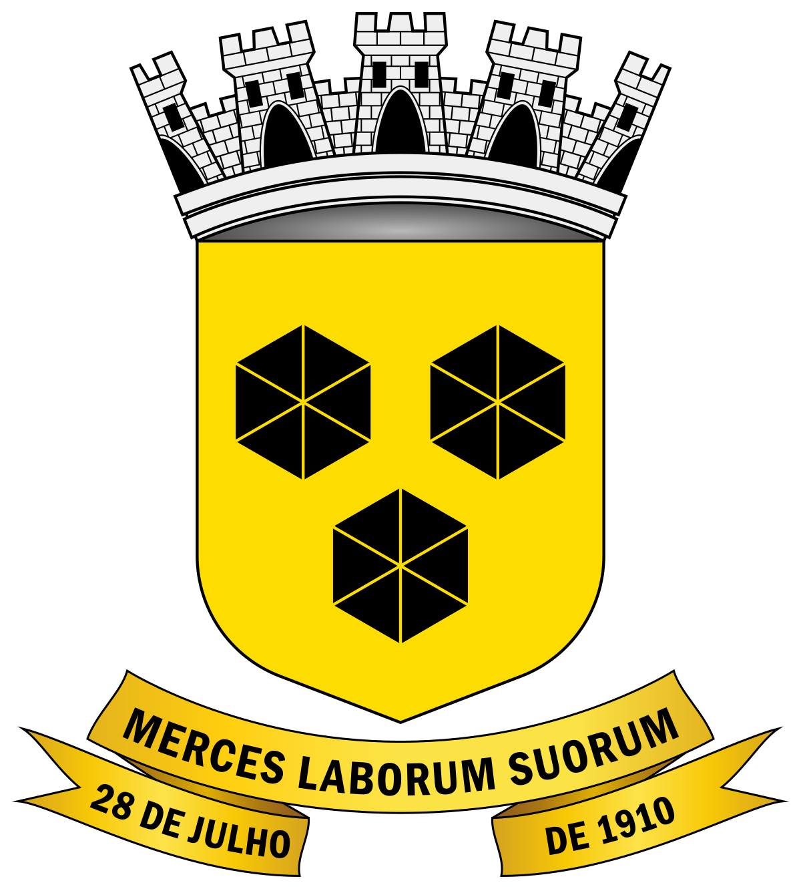

</a>

# Prefeitura Municipal de Itabuna

## Sobre o projeto

  Este repositorio se destina à matéria de Interação Humano-Computador da Universidade de Brasília. Tem como objetivo analisar o site da <a href="https://web.archive.org/web/20220208082252/https://prefeituradeitabuna.com.br/">Prefeitura Municipal de Itabuna</a>, aplicando os conceitos aprendidos no decorrer da matéria.

## Equipe
 Nome | Gihub | Matrícula
 ------ | --------  | ------
Alan Marques Sousa | [@alan-ms](https://github.com/alan-ms) | 180062026 |
Arthur Alves de Matos  | [@Arthur-Gaudium](https://github.com/Arthur-Gaudium) | 190010495 |
Caio Santos | [@caiobsantos](https://github.com/caiobsantos) | 170007413 |
Ciro Costa de Araujo | [@ciro-c](https://github.com/ciro-c) | 190011611 |
Vinicius Lima | [@vinelime](https://github.com/vinelime) | 180028839 |
Vinícius Roriz | [@viniciusroriz](https://github.com/viniciusroriz) | 190020814|